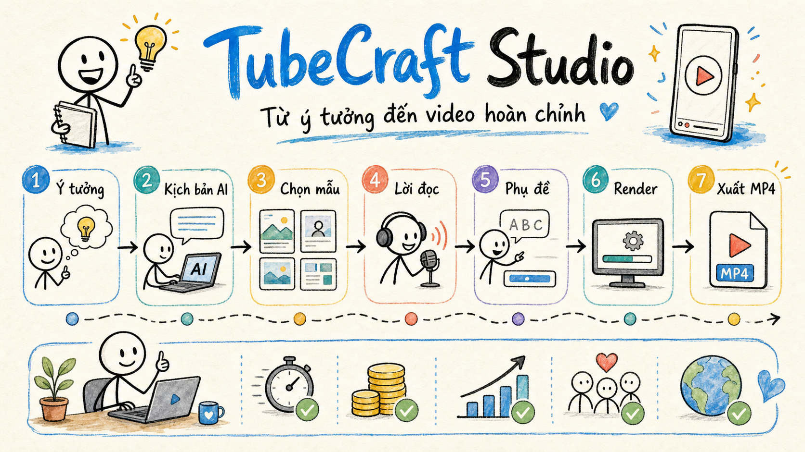

# TubeCraft

> A local-first AI video studio for turning an idea into a narrated, captioned video.

TubeCraft helps educators, creators, and small teams produce short-form or lesson-based videos from one brief. Create a structured script, refine each scene, generate narration with timing, preview the result, and export an MP4—all from a Windows desktop app.

<p align="center">
  
</p>

## Why TubeCraft

Most AI video tools lock the entire workflow behind a hosted editor. TubeCraft keeps the production workspace on your machine:

- **Local project files** — scripts, audio, jobs, previews, and exports stay under `data/`.
- **Provider choice** — use the AI and TTS provider that fits your account, quota, and language.
- **Scene-level control** — edit narration, visuals, templates, subtitles, colors, fonts, and backgrounds before exporting.
- **Reliable publishing** — background jobs use revisions and atomic writes so an old render cannot overwrite newer work.

## Quick start

**Requirement:** Windows 10/11 and Python 3.12+.

```powershell
git clone https://github.com/hungle123-dev/AI-Video-Maker-Studio.git
cd AI-Video-Maker-Studio
python run.py
```

That is the only command needed after cloning. On the first run, TubeCraft creates its virtual environment, installs Python and Canvas dependencies, and downloads Node.js, FFmpeg/FFprobe, and Chromium locally. Later runs open the app directly.

> The first run needs an Internet connection and can take several minutes. Downloaded runtimes, dependencies, projects, media, logs, and credentials are ignored by Git.

## From idea to MP4

```text
Idea
  → AI outline and lesson script
  → scene-by-scene editing
  → narration + word timing
  → preview + subtitle styling
  → Canvas render + FFmpeg encode
  → MP4 export
```

1. Create a project and select the aspect ratio, template, visual style, narration, and AI provider.
2. Generate a series with Autopilot or write/import a script yourself.
3. Refine individual steps in the editor and preview visuals before spending render time.
4. Generate audio, then render from the queue. Completed videos are stored in `data/outputs/`.

## Capabilities

| Area | What it provides |
| --- | --- |
| Script generation | Outline, long-form plan, lesson scripts, provider failover, JSON validation |
| Visual system | Templates, art styles, backgrounds, scene catalogs, effects, fonts, local gallery assets |
| Voice | Edge TTS, Google TTS, Deepgram Aura, EverAI, and Vivibe |
| Captions | Word-timed karaoke captions, style-aware presets, font scale and placement controls |
| Export | `9:16`, `16:9`, and `1:1` MP4 with audio verification before publish |
| Production controls | Persistent queue, cancellation, previews, revision-safe audio/video publishing |

## AI and TTS providers

TubeCraft supports Gemini, OpenAI, Claude, DeepSeek, OpenRouter, and a local 9Router-compatible endpoint for script generation. API keys are managed from the app and encrypted with Windows DPAPI.

For narration, select an engine in the project or settings. Cloud content is sent only to the provider you explicitly choose; the rest of the project workflow remains local.

## Architecture

```text
Flet desktop UI
       │
       ├── Project store (JSON + media revisions)
       ├── AI adapters / key rotation / retries
       ├── TTS adapters → timing map + merged audio
       └── Render queue
                │
                ├── Node Canvas scene renderer
                ├── Subtitle engine
                └── FFmpeg / FFprobe → validated MP4
```

| Directory | Purpose |
| --- | --- |
| `ui/` | Flet desktop views: dashboard, projects, editor, templates, queue, keys, settings |
| `core/` | Domain logic: project store, schemas, AI/TTS adapters, jobs, preview, security |
| `engines/` | Audio pipeline, Canvas renderer, subtitles, and video encoding |
| `assets/`, `static/`, `samples/` | Application assets, fonts, sprites, and template previews |
| `tests/` | Workflow, schema, renderer, UI, runtime, and release smoke tests |
| `data/` | Local runtime state; never commit this directory |

## Performance notes

TubeCraft renders scenes with Node Canvas and encodes video through FFmpeg. Hardware encoders such as NVIDIA NVENC accelerate video encoding; scene drawing itself is primarily CPU/RAM work.

For faster drafts, lower the render FPS or reduce the visual complexity. For final exports, close memory-heavy applications so the renderer can use more workers safely.

## Development

```powershell
python -m pytest -q
npm run check
```

The test suite covers script validation, key handling, TTS/render workflows, media revisions, UI actions, renderer integration, and startup/runtime checks.

## Privacy and data

- API keys are encrypted with Windows DPAPI in `data/keys.enc.json`.
- Project metadata, audio, outputs, logs, and queue state stay local in `data/`.
- A render is written to a temporary file, audio-verified with FFprobe, then published atomically.
- If the app restarts during a job, the job is marked interrupted instead of publishing partial media.

## Contributing

Bug reports and focused pull requests are welcome. Please include a short reproduction, expected behavior, and the smallest relevant test when changing production logic.

## License

No public license has been selected yet. Do not redistribute the project until a license is added.
