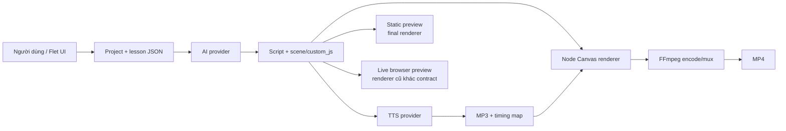

# TubeCraft — deep audit toàn hệ thống

Ngày audit: 2026-07-18  
Phạm vi: source độc lập `TubeCraft-Reconstructed`, bản portable hiện tại, dữ liệu/runtime thực tế, artifact reverse và bytecode gốc đã trích xuất.  
Nguyên tắc: tách **fact đã chứng minh**, **suy luận**, **giới hạn chưa kiểm chứng**; không xem việc app mở được hay test pass là bằng chứng sản phẩm hoàn chỉnh.

## 1. Kết luận thẳng

TubeCraft hiện tại **không phải vỏ UI giả**. Repo có source độc lập, kho project/lesson, nhiều AI provider, năm TTS engine, 29 template local, 47 scene dựng sẵn, subtitle engine, Node Canvas renderer, FFmpeg pipeline và job queue thực. Happy path `project → AI script → TTS → render MP4` đã chạy thật ít nhất một lần với video 62,11 giây.

Nhưng cũng **chưa thể gọi là app hoàn chỉnh, “y chang bản gốc”, hoặc release-ready**:

- Có một lỗi bảo mật P0: JavaScript do AI hoặc project import cung cấp được chạy bằng `new Function` trong Node và truy cập được filesystem/process của máy.
- Renderer có thể mất toàn bộ hình minh họa nhưng vẫn trả thành công và tạo MP4 chỉ còn heading/caption.
- Sửa script không làm cũ/invalidate audio, timing và video; app có thể ghép nội dung mới với media cũ.
- Render production không có deadline hay nút hủy; một scene treo có thể khóa hàng đợi vô hạn.
- Import project có đường traversal qua `lesson.id`; build thông thường có thể xóa dữ liệu đang nằm trong `dist\TubeCraft\data`.
- Live preview dùng renderer cũ, thiếu API mà generator bắt buộc, và không phản ánh final render.
- UI quảng bá 9:16, 16:9 và 1:1 nhưng generator thực chất hardcode 9:16.
- “Template” chủ yếu là preset phong cách/prompt, không phải video có sẵn; điều khiển effect hiện không đi đúng vào generator.
- Không có pipeline tự tìm B-roll, ảnh stock hoặc sinh ảnh. Hình hiện có là procedural Canvas infographic.
- Vivibe đã chạy trên máy hiện tại nhưng bản portable sạch không kèm browser mà Playwright cần.

Định vị khách quan: **functional beta có lõi thật, nhưng security, data safety, render correctness và portable readiness đều chưa đạt release gate**.

## 2. Tool này thực sự làm gì

TubeCraft là một desktop workflow tạo video giáo dục dạng infographic:

Các hình minh họa mặc định là vector/Canvas được dựng từ primitive hoặc `custom_js`. `image` element chỉ hoạt động khi script có `src` cụ thể. Không có UI chọn media cho từng scene, không có stock search, và không có image-generation backend end-to-end. Vì vậy kỳ vọng “AI tự chèn cảnh quay/ảnh thật minh họa” hiện là **capability chưa tồn tại**, không phải một tùy chọn bị khóa.

“Template mẫu” hiện là bộ preset gồm tên, art style, màu, font, topic và effect dùng để tạo thumbnail/demo. Nó không phải một timeline video hoàn chỉnh chỉ thay chữ. Một số scene dựng sẵn có nhiều thành phần/animation, nhưng generator vẫn quyết định nội dung từng step.

## 3. Phương pháp và bằng chứng

Audit dùng sáu lớp bằng chứng:

1. Inventory source, assets, portable distribution và data thật.
2. Structural audit bytecode gốc: module, code object, opcode và signature.
3. Differential behavior harness giữa exact bytecode, reconstructed baseline và source hiện tại.
4. Test suite, branch coverage, syntax/static checks và dependency consistency offline.
5. Runtime probes bằng đúng Node/FFmpeg bundled, render log, FFprobe, Vivibe log và frame inspection.
6. Manual end-to-end code trace cho UI, AI, TTS, preview, render, import, build và persistence.

Quy mô được kiểm:

- 93 file Python/JavaScript nếu tính cả tests, 22.347 dòng.
- 7.305 Python statements trong coverage scope.
- Portable hiện có 1.856 file, khoảng 766,1 MiB; riêng user data đang nằm trong portable khoảng 110,2 MiB.
- Hotspot lớn nhất: `canvas_renderer.js` 4.840 dòng, browser preview 2.043 dòng, Projects UI 1.479 dòng, subtitle engine 1.439 dòng.

Các kiểm tra đã chạy:

- `pytest`: **61/61 pass**.
- Branch coverage tổng: **47%**; `tts_vivibe` 24%, `audio_engine` 27%, `video_encoder` 26%, `render_service` 43%, `script_generator` 45%. JavaScript renderer không có coverage.
- `pip check`: sạch.
- `pyflakes`: sạch.
- `node --check` cho ba renderer JS: sạch.
- `npm ls --omit=dev --depth=2`: sạch.
- `npm audit --offline` báo 0 nhưng **không chứng minh** không có CVE hiện hành vì không cập nhật vulnerability database.

Test hiện tại chủ yếu dùng FakePage và mock cloud API. Real renderer integration chỉ tạo video text-only dài khoảng 0,3 giây. Không có packaged GUI E2E, clean-machine test, malicious-project test, browser-JS test, visual geometry golden test hoặc real provider contract test đầy đủ.

## 4. Độ độc lập và parity với app gốc

### 4.1 Source độc lập

Source active không import `reverse_engineered`, `exact_bytecode`, `.pyc` hay reconstructed payload. Node, FFmpeg, FFprobe, Canvas runtime, assets và Python dependencies đều được đóng cùng repo/portable. Tiêu chí “repo chạy không dựa vào bytecode reverse” đạt.

Ngoại lệ “không phụ thuộc bên ngoài” cần hiểu đúng: Gemini/Claude/OpenAI-compatible và mọi TTS cloud vẫn cần Internet/dịch vụ/tài khoản. Vivibe còn cần browser tương thích.

### 4.2 Baseline reverse

Exact-bytecode structural audit của app gốc ghi nhận:

- 78 module ứng dụng.
- 1.060 code object exact; 1.025 code object reconstructed.
- 1.015 qualname khớp; 731 opcode-identical; 922 gần số instruction.
- 45 exact qualname không có trong reconstructed baseline, tập trung nhiều ở subtitle picker và script generator.

Behavior harness của reconstructed baseline đạt **963/998** case. 35 mismatch nằm ở inventory/signature, còn các nhóm AI, audio, autopilot, background, config, crypto, Deepgram, export, font, job, key, license, preview, project, render, scene, schema, script, subtitle, template, updater và video đều khớp các case được kiểm.

Điều này chứng minh baseline reverse có fidelity hành vi cao trong phạm vi harness; nó **không** chứng minh pixel parity hay mọi đường UI/runtime.

### 4.3 Repo hiện tại so với exact

Một compatibility-stage chỉ bổ sung shim cho các module cố ý loại bỏ (`license`, `updater`, template store cũ) để legacy harness có thể chạy. Kết quả là 937/1.003 case khớp. Không dùng con số này như “93,4% parity score”, vì shim không thuộc repo active.

Điểm có giá trị là: mọi behavior group chung đều khớp, ngoài ba khác biệt chức năng:

- `keys/lifecycle`: repo local đã bỏ central/license keys và thêm unique label/Gemini probe đúng protocol.
- `templates/list` và `templates/options`: tám paid pack cũ được đưa thành template local, tổng 29 template.

Phần còn lại của 66 mismatch là inventory/signature do source hiện tại thêm helper, bỏ license/updater và thay UI. Đây phần lớn là divergence có chủ ý, không phải bằng chứng logic sai.

### 4.4 Phân loại divergence

| Thay đổi | Đánh giá |
|---|---|
| Bỏ license route/client/guard | Có chủ ý theo yêu cầu app local; không phải lỗi reverse |
| Đưa pack trả phí thành 29 template local | Có chủ ý; behavior list khác bản gốc |
| Bỏ updater | Có chủ ý nhưng mất automatic update; cần quy trình release mới |
| Thêm Vivibe 13 voice | Port-specific, không thuộc app gốc |
| Sửa duplicate import làm thay đổi source project | Cải tiến đúng so với baseline decompile |
| Sửa Gemini model probe | Cải tiến đúng |
| Thêm layout linter gần đây | Hardening mới, chưa có trong EXE hiện tại |

## 5. Feature/workflow matrix

| Khu vực | Có code thật | Evidence runtime/test | Trạng thái khách quan |
|---|---:|---:|---|
| Project/lesson CRUD | Có | Unit/integration pass | Hoạt động; còn traversal, race, orphan output |
| Editor step/text/elements | Có | FakePage workflow pass | Cơ bản hoạt động; sửa script không invalidate media |
| AI script generation | Có, 6 LLM routes | Mock tests + Gemini từng chạy thật | Hoạt động có điều kiện; raw JS là P0 |
| Autopilot series/long video | Có | Mocked behavior tests | Logic tồn tại; chưa real-cloud/GUI E2E |
| Template local | 29 template | List/customization tests | Có thật; effect semantics đang lệch |
| Scene deterministic | 47 scene | Registry/demo tests | Điểm mạnh; nên là đường render an toàn chính |
| Edge TTS | Có | Audio tests; phụ thuộc cloud Edge | Hoạt động có điều kiện |
| gTTS | Có | Probe MP3/test | Hoạt động; không word boundary thật |
| Deepgram/EverAI | Có | Mock tests | Chưa chứng minh real account E2E |
| Vivibe 13 voice | Có | Log thực: batch 8 câu, 62,1 s | Chạy trên máy này; portable sạch chưa đạt |
| Static preview | Có | Real Node PNG test | Renderer gần final nhất; vẫn nuốt runtime JS error |
| Live browser preview | Có | Code/runtime trace | Không đáng tin; contract/style/layout drift |
| Subtitle/karaoke | 16 preset | Logic/tests + video thật | Có; layout phụ thuộc scene và timing |
| Render MP4 | Có | Real 0,3 s test + video 62,11 s | Có thật; chậm, no timeout/cancel, false success |
| 16:9 / 1:1 | UI có | Chưa có visual E2E | Không đáng tin; generator hardcode 9:16 |
| Excel export | Có | Test pass | Có; còn formula injection |
| Font install/online | Có | Test phần lớn mock | Partial; path/package/source issues |
| Intro/outro | Metadata + encoder có | Không có caller E2E | Dormant, chưa được nối vào render service |
| B-roll/stock/image generation | Không | Không có backend/UI flow | Capability thiếu |
| License | Đã bỏ | Route test xác nhận không còn | Đúng yêu cầu local |
| Updater | Đã bỏ | Không còn module active | Trade-off; release thủ công |

Video không có hard wall-clock min/max. UI cho 8–40 step, estimate 12 giây/step, tương đương khoảng 1,6–8 phút mỗi lesson; “AI tự quyết” và editor có thể vượt phạm vi đó. Thời lượng thực do TTS quyết định.

## 6. Finding P0 — release blocker

### TC-SEC-001 — AI/imported JavaScript được thực thi như host code

Mức độ: **P0 / Critical**  
Nguồn gốc: **kế thừa từ app gốc**  
Độ tin cậy: **High, static + dynamic proof**

Chuỗi trust boundary:

1. `core/script_generator.py:72` yêu cầu model trả raw `custom_js` cho từng step.
2. `core/project_store.py:126-156` copy project ngoài vào mà không sanitize script.
3. `core/schema.py:94-167` chỉ kiểm kiểu và cú pháp JS.
4. `engines/canvas_renderer.js:4112-4114,4196` chạy code bằng `new Function`.
5. Browser preview cũng làm tương tự tại `engines/web/preview_renderer.js:1260-1263,1692`.

Bundled Node 22.17.1 đã được probe trực tiếp: code trong `new Function` thấy `process`, `process.env`, `process.getBuiltinModule` và `fetch`; probe `fs.existsSync('README.md')` trả `true`. Vì vậy model response hoặc project được import có thể đọc/ghi file, gọi process con, gửi dữ liệu ra mạng hoặc kết thúc/treo renderer.

Root fix tối thiểu đúng hướng: dừng nhận raw JavaScript từ trust boundary. Model chỉ được trả declarative scene schema và chọn trong 47 scene đã có. Legacy `custom_js` nếu bắt buộc phải giữ thì chạy trong broker OS low-privilege không filesystem/network/process, có AST allowlist, memory/CPU/deadline. Node `vm` riêng lẻ không phải security boundary đủ mạnh.

## 7. Finding P1 — phải sửa trước khi gọi hoàn chỉnh

### TC-REN-001 — mất hình nhưng job vẫn báo thành công

`canvas_renderer.js:4195-4207` catch mọi runtime exception của `custom_js`, ghi stderr rồi tiếp tục. Python chỉ fail khi process return code khác 0 (`video_encoder.py:420-470`). Static preview cũng xem rc=0 + có PNG là thành công (`core/preview.py:87-93`).

Hệ quả đúng với lỗi người dùng đã gặp: scene illustration có thể biến mất toàn bộ, nhưng MP4 vẫn được tạo và UI báo 100%. Syntax-only validator không phát hiện undefined API, runtime geometry hoặc code chỉ lỗi ở frame/time cụ thể.

Phải aggregate error theo scene/frame, đặt threshold, và fail render nếu coverage hình giảm hoặc custom scene lỗi. Không được biến exception thành video “thành công”.

### TC-DAT-001 — script mới có thể dùng audio/video cũ

`ProjectStore.save_script` ghi script nhưng không invalidate timing, audio, rendered path hay status (`core/project_store.py:210-215`). Render service thấy audio cũ vẫn hợp lệ và tái dùng (`core/render_service.py:122-146`). UI vẫn mở rendered video cũ (`ui/projects/view.py:1495-1505`).

Đây là lỗi correctness lớn: sửa narration/step có thể tạo hình mới ghép giọng cũ, hoặc người dùng bấm xem mà nhận video trước khi sửa.

Fix: lưu content hash/version vào script, timing, audio và video manifest. Bất kỳ thay đổi script/style/subtitle/aspect nào phải invalidate đúng downstream artifact; UI phải hiển thị stale, không coi là done.

### TC-REN-002 — production render không deadline/cancel

`video_encoder.py:420-470,582-650` chờ Node/FFmpeg không có overall timeout. Render queue không có cancel token/process-tree termination. Một `while(true)` trong custom scene có thể khóa worker duy nhất vô hạn.

Fix: absolute monotonic deadline dựa trên duration + headroom, cancel token, Windows Job Object/process group, terminate → await → hard kill, cleanup trong `finally`.

### TC-IMP-001 — imported lesson ID có thể thoát project root

Import chỉ validate project ID. `lesson.json.id` được trust, `_lesson_dir` join trực tiếp, và delete dùng `shutil.rmtree` (`core/project_store.py:132-159,161-180,217-221`). UI truyền raw `lesson['id']` vào các API này.

Một project crafted có thể dùng `..`/absolute/reparse path để đọc, ghi hoặc xóa ngoài lesson root. Đây là lỗi đã có trong baseline logic; current chỉ harden project ID, chưa harden lesson boundary.

Fix: regex ở mọi public ID boundary, `resolve()` + containment/`relative_to(root)`, derive ID từ safe directory, reject symlink/reparse point. Thêm malicious-import regression test.

### TC-BLD-001 — rebuild có thể xóa user data

Frozen config cố ý đặt `DATA_DIR` cạnh EXE (`config.py:8-19`). `build.ps1:18-19` chạy PyInstaller `--noconfirm --clean` thẳng vào `dist\TubeCraft`, nơi hiện chứa project, key, output và log thật. Không staging, backup hoặc migration.

Fix: dữ liệu runtime chuyển sang LocalAppData/Documents; build vào staging riêng, smoke-test rồi swap runtime. Trước khi migration xong, tuyệt đối không chạy build trực tiếp lên portable đang có data.

### TC-SEC-002 — “encrypted at rest” chỉ là obfuscation XOR

`core/crypto.py:7-34` tạo key bằng SHA-256(hostname + MAC + fixed shipped salt), rồi repeating XOR + Base64, không nonce và không authentication. Bất kỳ code local nào đọc được source đều derive được key. Ciphertext cũng có thể bị sửa mà không phát hiện.

Nó bảo vệ khỏi nhìn plaintext tình cờ, không bảo vệ cloud API key hay Vivibe password trước local attacker/process. Dùng Windows DPAPI/Credential Manager và migrate file cũ; portable mode nếu thật sự cần phải dùng authenticated encryption + user secret.

Operational: Gemini key đã được dán vào hội thoại. Cần revoke/rotate ngay; không lặp lại key trong log hoặc tài liệu.

### TC-PRE-001 — live preview không cùng contract với final renderer

Generator bắt buộc scene dùng `ui.*`, nhưng `preview_renderer.js:1262` không truyền `ui`; final renderer truyền `uiKit`. Browser preview thiếu các style mới, thiếu config background/subtitle, và custom-js y-offset chỉ advance đúng trong một nhánh pixel. File browser renderer còn exact-identical với app gốc, nghĩa là đây là bug kế thừa chứ không phải reverse sai.

UI vẫn mô tả preview “đúng renderer” và tự mở browser. Việc này giải thích tab đen/nhấp nháy mà người dùng thấy.

Fix ít nhất và chắc nhất: tạm bỏ live browser preview, dùng static/final renderer làm một source of truth. Chỉ phục hồi animation preview sau khi dùng chung renderer contract/test suite.

### TC-ASP-001 — UI hứa ba aspect, generator chỉ đạo 9:16

UI cho 9:16, 16:9, 1:1 (`ui/projects/view.py:564-569`). `generate_lesson_script` không nhận aspect; system/prompt hardcode 9:16, 1080×1920 (`core/script_generator.py:26-28,72,407-411`). Layout/subtitle repair chỉ xử lý `y_9_16`. Renderer còn có nhánh “16:9, còn lại coi như 9:16”, khiến tọa độ 1:1 chết.

Fix release-safe ngắn nhất: chỉ cho 9:16 cho tới khi aspect được truyền end-to-end và có golden visual tests. Nếu giữ cả ba, mọi scene/anchor/subtitle/intro/outro phải có contract riêng cho ba aspect.

### TC-VIV-001 — Vivibe chưa portable trên máy sạch

Vivibe source thử system Chrome rồi Playwright Chromium (`core/tts_vivibe.py:298-316`). `setup.ps1` không chạy `playwright install chromium`; PyInstaller chỉ bundle Python package/driver. Dist không có `chrome.exe`, `chromium.exe` hoặc `headless_shell.exe`.

Nó chạy trên máy audit vì có browser/environment phù hợp, nhưng claim portable sạch là sai với Vivibe. Code còn dùng `--no-sandbox`, stealth flags và hook mọi URL có `.mp3/.wav/ttsapi.app`, nên có security/correctness/compliance risk.

Fix: ưu tiên API được hỗ trợ/ủy quyền. Nếu vẫn browser automation, bỏ `--no-sandbox`, pin/bundle browser hoặc health-check yêu cầu system browser rõ ràng, giới hạn response theo host/MIME/size/request correlation. Đánh giá ToS là việc ngoài phạm vi code audit.

### TC-UI-001 — watcher/thread sống sau navigation và có thể cướp dialog

`main.py:112-144` gọi là cache nhưng luôn tạo view mới. Mỗi `RenderQueueView` tạo infinite refresh thread (`ui/render_queue/view.py:79-90`). Projects/editor watchers tiếp tục sống khi navigation đổi view và có thể mở completion dialog trên trang khác. `main.py:85-95` đóng/eject dialog đang mở khi một dialog mới tới.

Hệ quả: leak thread, update detached control, completion popup có thể đóng dialog template/subtitle/AI đang nhập. Cần lifecycle/dispose token; chỉ một queue poller; completion chuyển thành notification không phá modal hiện tại.

### TC-MED-001 — không có automatic illustrative media pipeline

`images=` chỉ được gửi làm context cho LLM; `GALLERY_DIR` không có producer/consumer flow đúng, renderer chỉ đọc `image.src` thủ công. Vì thế video hiện tại chỉ có procedural illustration, text và background.

Đây là **requirement gap**, không phải lỗi tọa độ. Cần quyết định sản phẩm: nếu mục tiêu là infographic, UI/README phải nói rõ. Nếu mục tiêu có B-roll/ảnh thật, phải xây media search/generation, licensing, download cache, crop/fit, attribution và fallback như một feature riêng.

## 8. Findings P2/P3 — chất lượng và độ bền

| ID | Finding | Bằng chứng/ảnh hưởng |
|---|---|---|
| TC-SET-001 | Settings có no-op/misleading controls | AI/model/voice/FPS được lưu nhưng create project dùng `last_config`; encoder hardcode 30 FPS. Blank Vivibe fields không thể clear credential cũ. |
| TC-TPL-001 | Effect template không đi vào generator | UI edit field `effect`; generator đọc `effects`/`ai_hint`. Nhiều template không có hai field này, nên thumbnail đổi nhưng generated scene không đổi tương ứng. |
| TC-GPU-001 | Nhãn GPU sai với path phổ biến | Pipe chunks hardcode `libx264`; log có thể nói NVIDIA trong khi phần render chính chạy CPU. NVENC chỉ dùng ở fallback/stitch path hẹp. |
| TC-AI-001 | 429 không rotate/cooldown như contract | `_raise_for_status` map 429/529 thành temporary error; generate abort thay vì quota error/next key. `MAX_KEY_ATTEMPTS=4` bỏ qua key sau key thứ tư. |
| TC-AI-002 | Claude model probe sai protocol | Dùng Bearer `/chat/completions` thay vì Anthropic API, nên key/model hợp lệ có thể bị UI báo lỗi. |
| TC-AI-003 | Gemini key nằm trong query string | Main generate và key test có path dùng query param; dễ lọt qua proxy/error URL log. Dùng `X-goog-api-key` nhất quán. |
| TC-TTS-001 | TTS rerun xóa bản tốt trước | `audio_engine.py:337-455` xóa/ghi đè master/chunk trước khi toàn bộ job thành công; failure để lại bundle thiếu/partial. |
| TC-TTS-002 | EverAI “300 giây” có thể kéo dài ~80 phút | 150 poll × sleep + request timeout tới 30 giây; không dùng absolute deadline/cancel. |
| TC-DAT-002 | ProjectStore RMW không thread-safe | Fixed `.tmp`, không lock quanh read-modify-write; background job và UI có thể lost update hoặc replace fail. |
| TC-PROC-001 | Fallback có thể để sót Node/FFmpeg | On gather error chỉ terminate parent rồi khởi động fallback, không await/hard-kill process tree. |
| TC-FONT-001 | Font shipped sai path | Final renderer tìm `static/YouthTouch.ttf`/`Pangolin-Regular.ttf`; file thật ở `engines/web`. Final và preview fallback khác nhau. |
| TC-FONT-002 | User font không portable | Copy vào `BASE_DIR/static/fonts`, manifest lưu absolute path; move/rebuild portable làm mất/break path. |
| TC-FONT-003 | Online font source/ZIP thiếu giới hạn | UI nói Google Fonts nhưng tải qua third-party `gwfh.mranftl.com`; đọc response/ZIP vào RAM không cap ratio/entry/size. |
| TC-XLS-001 | Excel formula injection | AI/imported strings bắt đầu `= + - @` được đưa thẳng vào cell OpenPyXL. |
| TC-PRE-002 | Preview payload leak | Global payload map không TTL/unregister; audio `read_bytes()` toàn file; CORS `*`; session dài tăng RAM và giữ stale URL. |
| TC-DEL-001 | Delete để orphan | Xóa project/lesson không dọn output/job/preview liên quan, `ignore_errors=True` vẫn trả true. |
| TC-IO-001 | Intro/outro là dead feature | Metadata và encoder concat có, nhưng render service không truyền path; 1:1 concat còn dùng size dọc. |
| TC-PRV-001 | Disclosure “local” chưa đủ | Topic/script/image đi tới LLM; narration đi tới TTS/Vivibe. README chưa mô tả provider-specific data flow/consent. |
| TC-BLD-002 | Build không reproducible/gate thiếu | Không lock transitive/hashes; setup upgrade pip latest; build không chạy `npm run check`, clean-VM/package/security smoke. |
| TC-DEP-001 | Current CVE status unknown | Offline audit không thể kết luận dependency không có CVE hiện hành. |

## 9. Deep dive lỗi output/layout hiện tại

Case video tám scene đã được dùng như một experiment, không phải làm chuẩn cho toàn audit:

1. Script Gemini sinh raw `custom_js` có absolute 9:16 anchors và tall card.
2. Frame hiện tại cho thấy heading, card, icon và subtitle chồng nhau.
3. Cùng script được chạy bằng renderer gốc; scene vẫn chồng, thậm chí nặng hơn.
4. Điều này bác bỏ giả thuyết “tọa độ bị reverse sai”. Root cause là AI output vi phạm layout contract + validator không kiểm runtime geometry/semantic overlap.
5. Bốn raw AI scene được thay bằng deterministic scene primitive và cả tám frame sau repair đã được inspect sạch.
6. Generator source được thêm layout guard/linter; focused tests pass 5/5.

Tuy nhiên:

- `TubeCraft.exe` build lúc 14:54:43, còn `core/script_generator.py` được sửa lúc 15:44:22. EXE đang chạy **chưa chứa guard mới**.
- Full repaired MP4 render bị dừng trước khi hoàn tất; file MP4 active và backup cũ hiện byte-identical.
- FFprobe của MP4 hiện tại: H.264 + AAC, 1080×1920, 30 FPS, 62,11 giây, 38.426.799 byte.
- Log render trước đó mất khoảng 10 phút 27 giây cho video 62,1 giây khi chỉ còn một worker vì RAM trống thấp.

Vì vậy không được tuyên bố “video đã sửa xong”. Source lesson repair đã active, nhưng final MP4 vẫn cần rerender sau khi root fixes/build safety được xử lý.

## 10. Điểm mạnh thực sự

- Source độc lập, không phụ thuộc bytecode/runtime reverse.
- Behavioral reconstruction baseline rất cao trong phạm vi harness.
- 47 scene deterministic và 29 template local là tài sản tốt; có thể thay raw AI JS bằng declarative schema mà không phải viết lại renderer từ số 0.
- Project/job persistence file-based dễ debug/backup.
- Video final dùng `.rendering.mp4` và chỉ replace target sau success; test xác nhận video cũ còn nguyên khi encoder fail.
- Subprocess chính dùng argv, không `shell=True`, giảm command injection truyền thống.
- Bundled Node/FFmpeg/FFprobe/Canvas thực sự hoạt động.
- Vivibe batch dùng một login, có retry/healing và đã tạo audio thật trên máy audit.
- Static preview dùng final Node renderer, là nền tốt để hợp nhất preview.
- Current repo đã sửa một số lỗi decompile baseline thay vì sao chép mù quáng.

## 11. Roadmap sửa dứt điểm theo root cause

### Gate 0 — an toàn trước mọi build/render mới

1. Tắt AI/imported raw `custom_js`; dùng allowlisted declarative scene schema dựa trên 47 scene hiện có.
2. Validate/canonicalize mọi project/lesson/path boundary; reject link/reparse/import crafted.
3. Chuyển data khỏi `dist`; build staging + migration/backup test.
4. Chuyển secret sang DPAPI/Credential Manager; rotate key đã lộ.

### Gate 1 — correctness của pipeline

5. Error trong scene phải làm render fail với scene ID; thêm visual coverage check.
6. Content hash + dependency manifest; script/style/aspect/subtitle đổi phải invalidate audio/video đúng tầng.
7. Deadline/cancel/process-tree cleanup cho TTS/Node/FFmpeg.
8. Chỉ giữ 9:16 tạm thời hoặc implement aspect end-to-end; không để UI quảng bá đường chưa đúng.
9. Bỏ browser preview cũ; static/final renderer là source of truth duy nhất.
10. TTS render vào staging bundle rồi atomic swap.

### Gate 2 — UI, template và portable

11. Điều khiển settings/template hoặc phải wire thật, hoặc xóa khỏi UI. Không giữ control no-op.
12. Sửa lifecycle/dispose của view/poller/watcher và modal queue.
13. Chọn chiến lược Vivibe: supported API hoặc bundle/health-check browser rõ ràng; bỏ `--no-sandbox`.
14. Sửa font paths, font storage, preview serving và package assets.
15. Sửa provider adapter 429/Claude/Gemini, store locking, Excel escaping, preview TTL/range.

### Gate 3 — release evidence

16. Golden visual E2E cho mọi deterministic scene, subtitle preset và aspect được hỗ trợ.
17. Malicious custom-js/import/path/formula regression tests.
18. Clean Windows VM packaged smoke: create → real key opt-in → TTS → preview → render → reopen data.
19. Rebuild-with-existing-data test; crash/cancel/resume tests.
20. Online dependency vulnerability/license audit và provider privacy disclosure trước phát hành.

## 12. Definition of done khách quan

Chỉ nên gọi task “hoàn chỉnh” khi đồng thời đạt:

- Không còn P0/P1 open.
- App không chạy raw model code với host privileges.
- Edit bất kỳ upstream input nào không bao giờ dùng nhầm stale downstream media.
- Render lỗi/hang có error rõ, timeout và cancel; không báo false success.
- Dữ liệu sống sót qua rebuild/move/update/crash.
- Aspect nào xuất hiện trong UI đều pass visual E2E.
- Preview và final dùng cùng contract và pixel-diff trong tolerance đã định.
- Portable chạy trên clean VM theo dependency contract được công bố.
- Build artifact được tạo từ đúng source đã audit; hiện tại chưa đạt vì EXE cũ hơn generator source.
- Existing tests pass và coverage tăng có mục tiêu ở renderer/TTS/render service; test phải kiểm behavior nguy hiểm chứ không chỉ constructor/mock.

## 13. Giới hạn audit

- Chưa adjudicate điều khoản sử dụng Vivibe hay quyền redistribution; chỉ xác nhận kỹ thuật và nêu compliance risk.
- Chưa kiểm CVE online hiện hành.
- Chưa có credential/account để chạy real E2E cho mọi cloud provider.
- Chưa rerender xong MP4 repaired vì render diagnostic trước đó bị ngắt.
- Pixel parity toàn app gốc không thể suy ra chỉ từ 963/998 behavior cases; cần screenshot/video golden corpus từ app gốc.

## 14. Verdict cuối

Reverse chưa phải vấn đề duy nhất, và tiếp tục “vét bytecode” sẽ không tự chữa các lỗi lớn nhất. Nhiều lỗi quan trọng — raw JS RCE, renderer nuốt exception, stale media, preview drift, 9:16 hardcode, timeout — đã tồn tại trong logic gốc hoặc contract gốc. Bám bản gốc tuyệt đối thậm chí giữ nguyên các lỗi đó.

Hướng đúng là: giữ phần đã reverse tốt và deterministic assets, loại bỏ trust boundary nguy hiểm, hợp nhất renderer, thêm artifact invalidation và data-safe build. Sau các gate trên mới đáng quay lại pixel parity và tinh chỉnh từng output.
